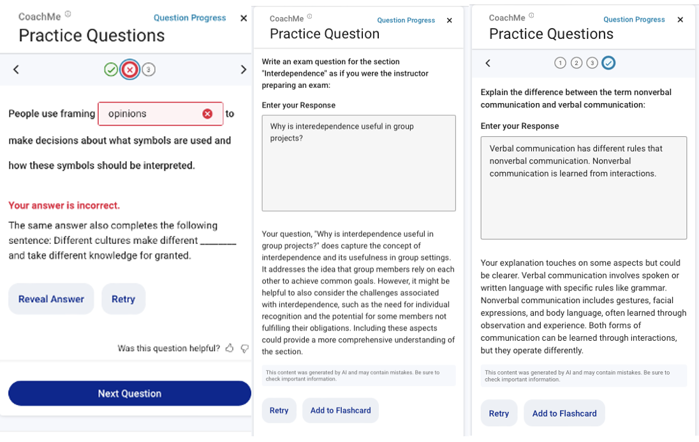

# Personalized Feedback for Open-Ended Questions Dataset

This directory contains the dataset and analysis code for our paper:

Van Campenhout, R., Dittel, J. S., Jerome, B., Clark, M. W., &
Johnson, B. G. (2025). Open-ended questions need personalized
feedback: Analyzing LLM-enabled features with student data. In
*Proceedings of the Second Workshop on Automated Evaluation of
Learning and Assessment Content at the 26th International Conference
on Artificial Intelligence in Education (AIED
2025)*. [\*\*\*UPDATEhttps://drive.google.com/file/d/1vO21K60lDf18izQdr79CpJxOvfXvHQBM/view](https://drive.google.com/file/d/1vO21K60lDf18izQdr79CpJxOvfXvHQBM/view)

This paper was presented at [AIED 2025](https://aied2025.itd.cnr.it/)
as part of the [Second Workshop on Automated Evaluation of Learning
and Assessment
Content](https://sites.google.com/cam.ac.uk/eval-lac-2025).

## Description

Automatically generated questions have made it possible to scale
formative practice across digital textbooks, offering students
frequent opportunities to reflect and self-assess as they read. Recent
advances in large language models (LLMs) open the door to expanding
these benefits by enabling more cognitively demanding question types,
especially when paired with personalized feedback.

In fall 2024, a generative AI–based feedback feature was introduced
into the existing automatic question generation system used in the
VitalSource Bookshelf platform. This feature was designed to
facilitate personalized, open-ended responses at scale. Two new
question types were created: exam question writing, which encourages
students to design their own test questions, and compare and contrast
(C&C), requiring students to explain differences between closely
related terms. Conventional fill-in-the-blank (FITB) questions were
used as a benchmark for comparing engagement, difficulty, and
persistence.

As shown below, the questions open in a panel next to the textbook
content. As formative practice, students are allowed as many answer
attempts as they like, receiving immediate LLM-generated feedback.

This analysis focuses on the effectiveness of LLM-generated
personalized feedback for both exam and C&C questions. These
open-ended formats encourage higher-order thinking by asking students
to synthesize content or distinguish between closely related concepts,
supported by feedback grounded in textbook content.

The dataset comprises student-question sessions from natural learning
contexts, collected between August 15, 2024, and February 9, 2025.
Each session captures all actions by an individual student on a single
question in chronological order, including answer attempts, student
ratings, and revision behavior such as multiple attempts on the same
question.
TODO:***Something about individual answer events for more detail.

The primary research questions for this study were:

1. What are the performance metrics for the new open-ended question types and how do they compare to the existing FITB questions as a benchmark?
2. How do the performance benchmarks differ between contexts where the questions are unassigned (students self-selecting to answer) and assigned (known classroom implementations)?
3. How does the LLM-generated personalized feedback perform?

Descriptive statistical analysis and text-analysis methods were
employed to explore these relationships, providing insights into
student learning behaviors and the impact of personalized feedback.

Further methodological details and analysis results can be found in
the paper above.

## Data Files and Analysis Code

The provided files are:

| File                                  | Description                                                                 |
| ------------------------------------- | --------------------------------------------------------------------------- |
| `exam_events.parquet`                 | Student-question interaction events for exam questions                      |
| `cc_events.parquet`                   | Student-question interaction events for C&C questions                       |
| `exam_sessions.parquet`               | Student-question sessions for exam questions                                |
| `cc_sessions.parquet`                 | Student-question sessions for C&C questions                                 |
| `fitb_sessions.parquet`               | Student-question sessions for FITB questions                                |
| `assess_exam_answers.py`              | Script assigning exam question student answer categories using LLM analysis |
| `assess_cc_answers.py`                | Script assigning C&C question student answer categories using LLM analysis  |
| `Open-Ended Questions Analysis.ipynb` | Jupyter notebook for replication of data analysis in the paper              |

In the dataset, student answer attempts are classified using shorthand
symbols to represent their accuracy and authenticity. Although these
symbols (`+`, `-`, `x`) are not used in the paper, they correspond
directly to the categories defined in the following table:

| Category    | Symbol | Description                                                                                             |
| ----------- | ------ | ------------------------------------------------------------------------------------------------------- |
| Correct     | `+`    | The response accurately addressed the key distinction between terms.                                    |
| Incorrect   | `-`    | The response did not sufficiently answer the question, despite appearing to be a genuine effort.        |
| Non-Genuine | `x`    | The response did not constitute a legitimate attempt (e.g., random characters, “idk”, irrelevant text). |

The interaction event fields are:

| Field              | Type        | Definition                                                      |
| ------------------ | ----------- | --------------------------------------------------------------- |
| `timestamp`        | string      | Date and time of answer attempt                                 |
| `student_id`       | string      | Anonymized student identifier                                   |
| `question_id`      | string      | Unique identifier for question                                  |
| `textbook_id`      | string      | Unique textbook identifier                                      |
| `subject`          | string      | Textbook's BISAC major subject heading (e.g., "Social Science") |
| `question`         | string      | Text of question                                                |
| `attempt_number`   | integer     | Sequential number of student's answer attempt                   |
| `answer`           | string      | Student-provided answer                                         |
| `feedback`         | string      | Feedback given by LLM on answer attempt                         |
| `attempt_category` | categorical | Answer attempt accuracy and authenticity (`+`, `-`, `x`)        |

The session fields are:

| Field                    | Type        | Definition                                                                                                        |
| ------------------------ | ----------- | ----------------------------------------------------------------------------------------------------------------- |
| `student_id`             | string      | Anonymized student identifier                                                                                     |
| `question_id`            | string      | Unique identifier for question                                                                                    |
| `textbook_id`            | string      | Unique textbook identifier                                                                                        |
| `subject`                | string      | Textbook's BISAC major subject heading (e.g., "Social Science")                                                   |
| `assigned`               | categorical | 1 if question was assigned, 0 otherwise                                                                           |
| `pattern`                | string      | Concatenation of `attempt_category` symbols for student answer attempts on question                               |
| `first_attempt`          | categorical | Category of first answer attempt (`+`, `-`, `x`)                                                                  |
| `second_attempt`         | categorical | Category of second answer attempt (missing if no second attempt)                                                  |
| `second_attempt_elapsed` | float       | Elapsed time (s) between student's first and second attempts                                                      |
| `second_attempt_overlap` | float       | Degree of textual overlap ([0, 1]) between student's second attempt and LLM's feedback on student's first attempt |
| `rating`                 | categorical | Student rating of session (`thumbs_up`, `thumbs_down`; missing if no rating given)                                |

## Acknowledgments

We thank the following publishers for granting permission to include
student use of the open-ended questions in their textbooks in this
dataset:

- Emond Publishing
- F. A. Davis Company
- Human Kinetics Publishers
- OpenStax
- SAGE Publications
- Taylor & Francis

## Contact Us

If you have questions, please feel free to email
[benny.johnson@vitalsource.com](mailto:benny.johnson@vitalsource.com).
