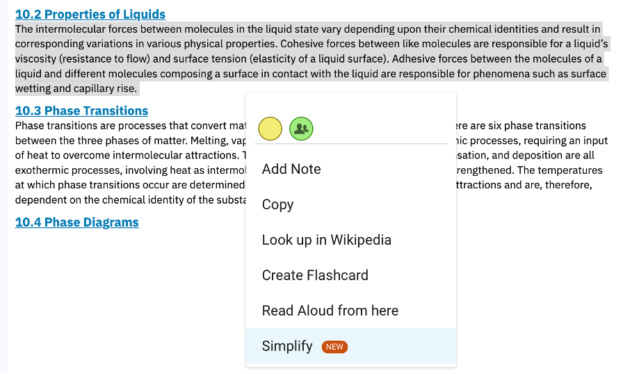
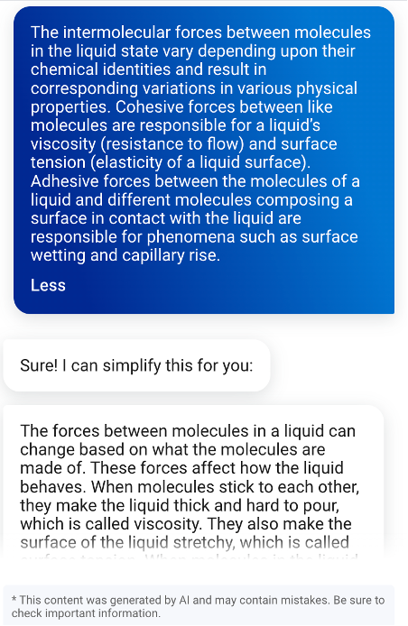

# Improving Textbook Readability Through AI Simplification Dataset

This directory contains the dataset and analysis code for our paper:

Johnson, B. G., Jerome, B., Dittel, J. S., & Van Campenhout,
R. (2025). Improving textbook readability through AI simplification:
Readability improvements and meaning preservation. In *Proceedings of
the Sixth Workshop on Intelligent Textbooks at the 24th International
Conference on Artificial Intelligence in Education*. CEUR Workshop
Proceedings. \*\*\*[https://doi.org/PLACEHOLDER\_DOI](https://doi.org/PLACEHOLDER_DOI)

This paper was presented at [AIED 2025](https://aied2025.itd.cnr.it/)
as part of the [Sixth Workshop on Intelligent Textbooks
(iTextbooks)](https://intextbooks.science.uu.nl/workshop2025/).

## Description

Many college students struggle with the complexity of textbook
language, especially when it includes specialized terminology or dense
syntactic structure. In fall 2024, the VitalSource Bookshelf ereader
platform introduced a generative AI feature called the *simplifier*,
which enables students to select challenging textbook passages and
receive simplified versions.

When a student highlights a passage of text and selects "Simplify"
(Figure 1), the original and simplified texts are displayed in a side
panel next to the textbook content (Figure 2).

 <b>Figure 1.</b> Activating the Simplify tool in the Bookshelf ereader interface by highlighting textbook content and selecting "Simplify."

 <b>Figure 2.</b> Simplified text displayed in an interactive side chat panel within the ereader.

This dataset captures 54,371 student-initiated simplification events
collected between September 1, 2024, and April 30, 2025. Each event
consists of a student-selected textbook passage, the corresponding
simplified version generated by OpenAI GPT-4o, and a set of computed
metrics evaluating changes in readability, vocabulary, syntax, and
semantic fidelity.

The simplifier is intended to reduce sentence complexity and improve
readability while preserving the meaning of the original passage. No
summarization or elaboration is explicitly requested. Simplifications
occur in real time and in authentic student learning contexts.

The research goals were to:

- Quantify improvements in readability from AI-based simplifications
- Evaluate whether simplifications preserve the original meaning
- Identify typical patterns of lexical and syntactic simplification

Further methodological details and analysis results can be found in
the paper.

## Example Simplification

The following example, drawn from a social science textbook,
illustrates a typical simplification event with strong readability
improvement and preserved meaning. The Flesch-Kincaid Grade Level
(FKGL), one of the main readability metrics used in the paper,
corresponds roughly to U.S. school grade levels and is used here to
demonstrate the improvement in readability.

**Original passage (FKGL = 19.89):**

> Although these criteria broadly define the essential differences
  between the sociological theories of structural functionalism and
  conflict theory, Bernard’s view is that the disagreement is far
  broader and has “been a recurring debate that has taken a variety of
  different forms throughout the history of Western thought”
  (1983:6). Bernard traced the debate back to ancient Greece (and the
  differences between Plato [consensus] and Aristotle [conflict]) and
  through the history of philosophy. Later, in sociology, the debate
  was joined by (the conflict theorist is listed first) Marx and
  Comte, Simmel and Durkheim, and Dahrendorf and Parsons. We already
  have examined briefly the ideas of the first two pairs of
  sociologists (although, as we have seen, their work is far broader
  than is implied by the label “conflict” or “consensus” theorist); in
  this chapter, we examine Dahrendorf’s conflict theory and Parsons’s
  consensus theory, among others.

**Simplified version (FKGL = 12.24, cosine similarity = .967):**

> The basic ideas of structural functionalism and conflict theory show
  their main differences. However, Bernard believes the disagreement
  is much bigger and has been a topic of discussion throughout Western
  history. He traced this debate back to ancient Greece, highlighting
  the differences between Plato, who focused on agreement, and
  Aristotle, who focused on conflict. In sociology, this debate
  continued with pairs like Marx and Comte, Simmel and Durkheim, and
  Dahrendorf and Parsons. We have already looked at the ideas of the
  first two pairs of sociologists. In this chapter, we will explore
  Dahrendorf’s conflict theory and Parsons’s consensus theory, among
  others.

This example reflects a clear reduction in linguistic complexity. The
cosine similarity value of .967 indicates a strong preservation of
meaning between the original and simplified passages.

## Data Files and Analysis Code

The provided files are:

| File                        | Description                                                                |
| --------------------------- | -------------------------------------------------------------------------- |
| `events.parquet`            | Dataset of simplification events with original/simplified text and metrics |
| `Simplifier Analysis.ipynb` | Jupyter notebook for replication of data analysis in the paper             |

The dataset contains the following fields:

| Field                               | Description                                                                 |
| ----------------------------------- | --------------------------------------------------------------------------- |
| `timestamp`                         | Date and time of simplification event                                       |
| `student_id`                        | Anonymized student identifier                                               |
| `textbook_id`                       | Textbook identifier                                                         |
| `subject`                           | Textbook subject area (e.g., Social Science, Psychology)                    |
| `selected`                          | Student-selected original textbook passage                                  |
| `simplified`                        | LLM-generated simplified passage                                            |
| `rd_sel_fkgl`                       | Flesch-Kincaid Grade Level (original passage)                               |
| `rd_sim_fkgl`                       | Flesch-Kincaid Grade Level (simplified passage)                             |
| `rd_sel_fre`                        | Flesch Reading Ease (original passage)                                      |
| `rd_sim_fre`                        | Flesch Reading Ease (simplified passage)                                    |
| `lex_sel_content_log_p`             | Mean log probability of content words (original passage)                    |
| `lex_sim_content_log_p`             | Mean log probability of content words (simplified passage)                  |
| `lex_sel_chars_per_word`            | Mean word length in characters (original passage)                           |
| `lex_sim_chars_per_word`            | Mean word length in characters (simplified passage)                         |
| `syn_sel_dep_depth`                 | Mean syntactic dependency depth (original passage)                          |
| `syn_sim_dep_depth`                 | Mean syntactic dependency depth (simplified passage)                        |
| `syn_sel_words_per_sentence`        | Mean sentence length in words (original passage)                            |
| `syn_sim_words_per_sentence`        | Mean sentence length in words (simplified passage)                          |
| `sem_sel_words`                     | Word count (original passage)                                               |
| `sem_sim_words`                     | Word count (simplified passage)                                             |
| `rd_fkgl_difference`                | FKGL difference (simplified – original)                                     |
| `rd_fre_difference`                 | FRE difference (simplified – original)                                      |
| `lex_content_log_p_difference`      | Difference in mean log probability of content words (simplified – original) |
| `lex_chars_per_word_difference`     | Difference in mean word length in characters (simplified – original)        |
| `syn_dep_depth_difference`          | Difference in mean syntactic dependency depth (simplified – original)       |
| `syn_words_per_sentence_difference` | Difference in mean sentence length in words (simplified – original)         |
| `sem_cosine_similarity`             | Cosine similarity between original and simplified passage                   |
| `sem_compression_ratio`             | Ratio of simplified to original word count                                  |

## Acknowledgments

We thank the following publishers for granting permission to include
student use of the simplifier feature in their textbooks as part of
this open dataset:

- Emond Publishing
- F. A. Davis Company
- Human Kinetics Publishers
- OpenStax
- SAGE Publications
- Taylor & Francis

## Contact Us

If you have questions, please feel free to email
[benny.johnson@vitalsource.com](mailto:benny.johnson@vitalsource.com).
