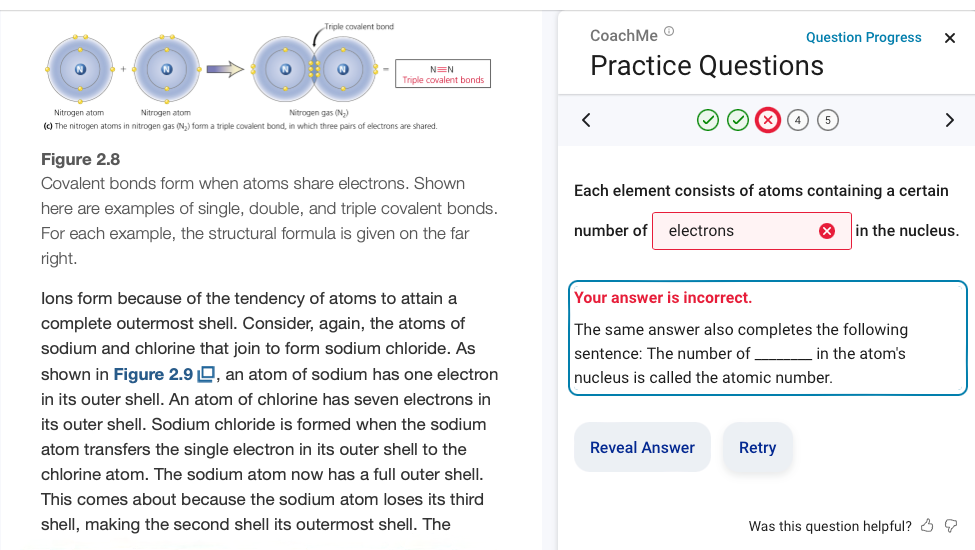
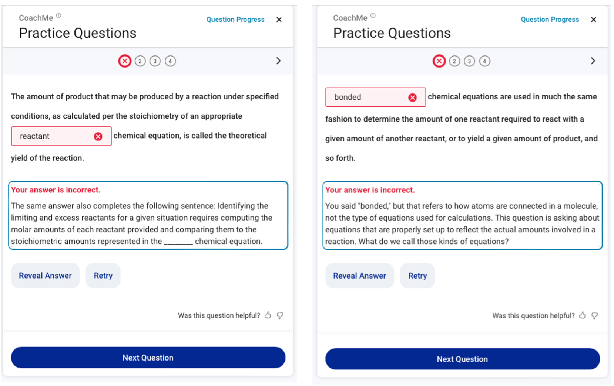

# Dynamic vs. Static Feedback for Textbook-Embedded FITB Practice Dataset

This directory contains the dataset and analysis code for our paper:

Johnson, B. G., Dittel, J. S., Ortiz, O. J., Bistolfi, R., Clark,
M. W., Jerome, B., Benton, R., & Van Campenhout, R. (2026). LLM
feedback isn't automatically better: Static scaffolds outperform
dynamic feedback in textbook-embedded practice. In *Proceedings of the
Seventh Workshop on Intelligent Textbooks at the 27th International
Conference on Artificial Intelligence in Education*. CEUR Workshop
Proceedings. [https://intextbooks.science.uu.nl/workshop2026/files/itb26_s1p1.pdf](https://intextbooks.science.uu.nl/workshop2026/files/itb26_s1p1.pdf)

This paper was presented at [AIED 2026](https://www.aied-conference.org/2026) as part of the
[Seventh Workshop on Intelligent Textbooks (iTextbooks)](https://intextbooks.science.uu.nl/workshop2026/).

## Description

Formative practice embedded within textbooks has been shown to increase learning
outcomes through the doer effect — the principle that doing practice while learning
is substantially more effective than reading alone. The VitalSource Bookshelf ereader
platform delivers formative practice through CoachMe, a free study feature that
integrates automatically generated questions directly alongside textbook content.
CoachMe supports several question types including fill-in-the-blank (FITB) cloze
questions, which are the focus of this study.

When a student answers an FITB question incorrectly, as shown in Figure 1, they
receive feedback along with options to retry, reveal the correct answer, and rate the
question.

 <b>Figure 1.</b> An example FITB formative practice question in a chemistry textbook.

Prior to this study, CoachMe deployed three types of static feedback for FITB
questions (common answer, context, and outcome feedback) selected according to a
preference hierarchy. Common answer feedback presents a second sentence from nearby
textbook content with the same target term removed, providing another retrieval cue.
Context feedback provides an extended excerpt of the surrounding passage. Outcome
feedback informs the student that their response is incorrect. Prior research found
that common answer feedback performed best on key behavioral outcomes and serves as
the benchmark for any new feedback approach.

Large language models (LLMs) lower the practical barrier to generating dynamic,
error-sensitive feedback conditioned on a student's actual incorrect answer.
Applying this approach to FITB questions, the system uses GPT-4.1 nano to generate
feedback intended to acknowledge the student's specific answer, explain why it does not
fit, and redirect the student without revealing the correct answer. A no-leak
guardrail checks generated feedback for the presence of the correct answer word; if
the answer is detected, the system falls back to static feedback. Figure 2 illustrates
common answer and dynamic feedback side by side.

 <b>Figure 2.</b> Examples of common answer and dynamic feedback for FITB questions.

This dataset captures 33,834 student-question sessions collected during a randomized
deployment from April 9, 2026, through May 8, 2026, using textbooks from eight
publishers who granted permission for generative AI research. Each incorrect first
attempt was randomly assigned with equal probability to either the dynamic feedback
condition or the existing static feedback approach. The unit of analysis is the
student-question session: all interactions by a given student on a given question,
anchored at an incorrect first attempt and followed through the next recorded action.
The final dataset covers 5,596 students, 23,148 questions, and 1,363 textbooks. The
top subject domains by percentage of sessions were Psychology (22.7%), Social Science
(19.1%), Political Science (15.7%), Business & Economics (12.2%), and Law (7.5%).

The research goals were to:

- Determine whether dynamic LLM-generated feedback improves student outcomes relative
  to the existing static feedback approach under random assignment.
- Identify which delivered feedback types are most associated with the observed
  differences in outcomes.
- Draw implications about the relationship between feedback design and target term
  recovery in textbook-embedded formative practice.

## Example Session

The following example, drawn from the textbook *Biological Psychology*
(Lyons et al., 2014), illustrates how the no-leak guardrail shapes
feedback delivery. For the item "The ANS is essentially the collection
of ______ that act as the manager of your internal organs," a student
answered "neurons."

The generated dynamic feedback was: *"You answered 'neurons,' which are the cells
that make up nerves, but the question is asking about the overall collection that acts
as the manager of your internal organs. What do we call that collection of nerve
fibers? Would you like to try again?"* This response is coherent and engages the
student's answer, but it approaches a definition of the target term and is rejected
by the no-leak guardrail. The system falls back to common answer feedback: *"Some
texts refer to a sub-set of the ANS known as the enteric nervous system, which refers
to a fine network of ______ that are found only in the walls of the digestive tract
and control the digestive process."* The correct answer is "nerves."

In the dataset, this session would appear with `assigned_condition` = `dynamic` and
`realized_condition` = `common_fallback`, reflecting the discrepancy between
assignment and delivered feedback introduced by the guardrail.

## Data Files and Analysis Code

The provided files are:

| File | Description |
| --- | --- |
| `sessions.parquet` | Session-level dataset of 33,834 incorrect-first-attempt sessions with feedback conditions and behavioral outcomes |
| `Feedback Analysis.ipynb` | Jupyter notebook for replication of the primary and secondary analyses in the paper |
| `dynamic_feedback_prompt.txt` | The full LLM prompt used to generate dynamic feedback |

The dataset contains the following fields:

| Field | Type | Description |
| --- | --- | --- |
| `timestamp` | datetime | Date and time of the incorrect first attempt |
| `student_id` | string | Anonymized student identifier |
| `question_id` | string | Unique question identifier |
| `textbook_id` | string | Unique textbook identifier |
| `subject` | string | Textbook BISAC major subject heading (e.g., "Psychology") |
| `question_stem` | string | Question text with the target term replaced by a blank (`______`) |
| `correct_answer` | string | Target term for the blank |
| `student_answer` | string | Student's incorrect first attempt |
| `assigned_condition` | categorical | Randomized assignment: `dynamic` or `static` |
| `realized_condition` | categorical | Feedback type actually delivered: `dynamic`, `common_assigned`, `common_fallback`, `context_assigned`, `context_fallback`, `outcome_assigned`, or `outcome_fallback` |
| `feedback_text` | string | Text of the feedback shown to the student |
| `next_action` | categorical | Student's next recorded action: `answer_reveal`, `correct_retry`, `incorrect_retry`, `answer_suggestion`, `no_action`, `rating_thumbs_up`, or `rating_thumbs_down` |
| `answer_reveal` | categorical | 1 if the student's next action was to reveal the correct answer, 0 otherwise |
| `correct_retry` | categorical | 1 if the student's next action produced a correct response, 0 otherwise |
| `edit_distance` | integer | Damerau-Levenshtein edit distance between `student_answer` and `correct_answer` |
| `edit_distance_quartile` | categorical | Quartile of `edit_distance` within the dataset (Q1–Q4) |

## Acknowledgments

We thank the following publishers for granting permission to include student use of
CoachMe formative practice questions in their textbooks as part of this open dataset:

- Cambridge University Press
- Emond Publishing
- F.A. Davis
- Human Kinetics
- OpenStax
- SAGE Publications, Inc. (US)
- SAGE Publications, Ltd. (UK)
- Taylor & Francis

## Contact Us

If you have questions, please feel free to email
[benny.johnson@vitalsource.com](mailto:benny.johnson@vitalsource.com).
