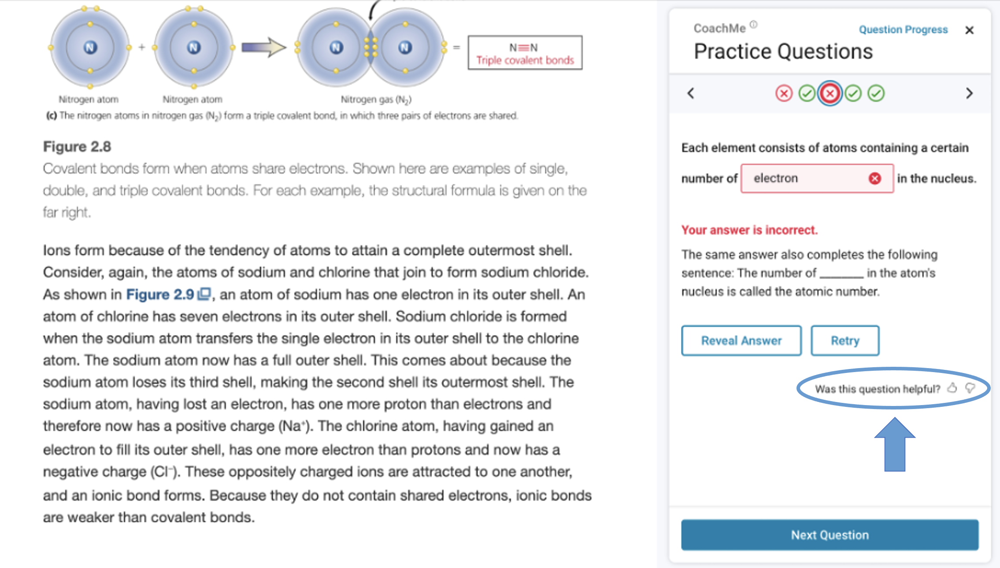

# Exploring Large Language Models for Evaluating Automatically Generated Questions Data Set

This folder contains the supporting data set and analysis code for our
project on evaluating the quality of automatically generated questions
using a large language model (LLM). This research is discussed in

Dittel, J. S., Van Campenhout, R., Clark, M. W., & Johnson,
B. G. (2024). Exploring Large Language Models for Evaluating
Automatically Generated Questions. 25th International Conference on
Artificial Intelligence in Education (AIED 2024), Workshop on
Automated Evaluation of Learning and Assessment Content, Recife,
Brazil, July
2024. https://drive.google.com/file/d/1vO21K60lDf18izQdr79CpJxOvfXvHQBM/view

This paper was presented at [AIED
2024](https://aied2024.cesar.school/) as part of the [Workshop on
Automated Evaluation of Learning and Assessment
Content](https://sites.google.com/view/eval-lac-2024/program?authuser=0).

## Description

Integrating formative practice questions with short sections of course
content has been shown to increase student learning gains. However,
question writing is a labor-intensive process that requires both
subject matter and item writing expertise. The volume of questions
needed for a typical course is in the hundreds or thousands, a scale
that is often prohibitive in time and cost for manual development.

We are using automatic question generation (AQG) to lower this
barrier, using electronic textbooks as source material. To date,
approximately 2.5 million automatically generated (AG) questions have
been added to thousands of online textbooks in the VitalSource
Bookshelf ereader platform as a free study feature called CoachMe,
available to millions of students. There are several types of AG
questions available, including fill-in-the-blank (FITB), matching,
multiple choice, and free response.

As shown below, the questions open in a panel next to the textbook
content. As formative practice, students are allowed as many answer
attempts as they like, receive immediate feedback, and can also reveal
the answer if stuck. Students are able to rate questions after
answering with a social media-style :+1: or :-1:. These ratings are
relevant to the current study.

As anyone who has created educational content is aware, no content is
perfect. Just as no human could write millions of perfectly performing
questions, neither does AI always generate perfect questions. Using
AQG on this unprecedented scale presents a new challenge in how to
monitor and perform quality assurance on this enormous question set.
For example, human review of the AG questions is not practical at this
scale.

We have developed [an automated system for montitoring question
quality](https://link.springer.com/chapter/10.1007/978-3-031-34735-1_22)
that currently employs two evaluation methods. One is a Bayesian
analysis that removes questions with a mean score likely to be below a
minimum acceptable threshold. The other uses student feedback given
through the thumbs up or down rating mechanism. Questions with more
than one thumbs down rating within the first 100 students answering
are removed. Even though this system can detect substandard questions
using a relatively small amount of data, filtering these out without
students seeing them at all would obviously be more desirable.

In this study, we investigate using a large language model to identify
unacceptable AG questions without student using data. Our procedure is
very simple. The LLM was directed to answer the questions as if it
were a student, and questions answered incorrectly are considered
unacceptable.  Why might this criterion be useful? The LLM is better
at answering the AG questions than students, so an incorrect answer
may be more likely to indicate a defect in the question rather than,
e.g., a limitation of the LLM’s knowledge.

The data set provided is from use of CoachMe in the Chemistry 101
course at a U.S. major public university in the Fall 2023
semester. The textbook used in the course was [Chemistry: Atoms
First](https://openstax.org/details/books/chemistry-atoms-first-2e)
from [OpenStax](https://openstax.org/). FITB questions, which are the
majority of the AG questions added to textbooks so far, are the
focus. These are created by selecting important sentences from
textbook content and turning them into cloze questions by removing an
important word as a blank for the student to fill in (shown
above). The data set comprises 54 FITB questions that met the
selection criteria in our paper, involving 247 students and 12,373
student-question interaction events.

This method successfully identified nearly 30% of the questions that
were rejected through analysis of student answer data. These results
suggest that LLMs can be a valuable tool in improving the quality
control process of automatically generated questions.

Please see the paper above for the details of the work.

## Data Files and Code Notebooks

The files provided are:

File | Description
-----|------------
question_data.csv | Question data set
events.parquet | Student-question interaction events
Exploring an LLM for Evaluating Automatically Generated Questions.ipynb | Jupyter notebook for data analysis

The fields in the question data set are:

Field | Type | Definition
------|------|-----------
`question_id` | string | Question identifier
`stem` | string | Question stem
`answer` | string | Correct answer word
`students` | integer | Number of students answering the question
`mean_score` | continuous | Fraction of students answering the question correctly on the first attempt
`thumbs_down` | integer | Number of students giving the question a :-1: rating
`reject_thumbs_down` | boolean | Whether question would be considered unacceptable because of multiple :-1: ratings
`reject_mean_score` | boolean | Whether question would be considered unacceptable because of low mean score
`reject` | boolean | Whether question would be considered unacceptable either for :-1: or mean score (`reject_thumbs_down \| reject_mean_score`)
`answer_stem` | string | LLM's answer to the question given only the question's stem
`answer_stem_correct` | boolean | Whether `answer_stem` is correct
`paragraph` | string | Question embedded in its textbook paragraph for context
`answer_paragraph` | string | LLM's answer to the question given the question's paragraph
`answer_paragraph_correct` | boolean | Whether `answer_paragraph` is correct

The fields in the student-question interaction events data set are:

Field | Type | Definition
------|------|-----------
`timestamp` | string | Date and time of event
`user_id` | string | Anonymized student identifier
`event_type` | categorical | `evaluate_response`: Check correctness of a student answer `reveal_answer`: Show the correct answer `flag_question`: Student rates a question :+1: or :-1: `answer_suggestion`: Give suggestion(s) for a potentially misspelled answer
`question_id` | string | Question identifier
`correct` | boolean | Whether student answer is correct for `evaluate_response` (null for other event types)
`first_attempt` | boolean | Whether this is student's first attempt to answer the question for `evaluate_response` (null for other event types)
`extra` | JSON | Additional event-specific data, e.g., student's answer for `evaluate_response`, rating for `flag_question`

The Jupyter notebook provided contains Python code for reproducing the
results given in the paper.

## Contact Us

If you have questions, please feel free to email benny.johnson@vitalsource.com.
