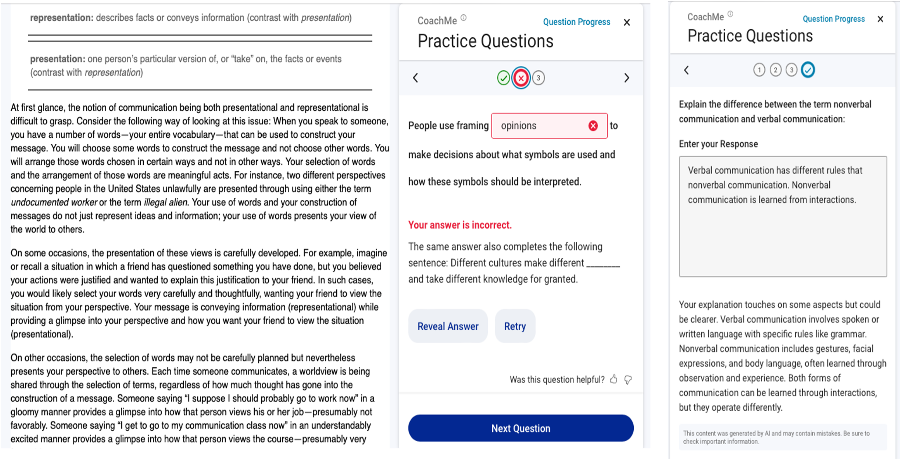

# LLM-Based Free-Response Tasks Dataset

This directory contains the dataset and analysis code for our paper:

Van Campenhout, R., Dittel, J. S., Jerome, B., & Johnson, B. G. (2026).
Extending an automatic question generation pipeline with LLM-based
free-response tasks: An analysis of performance metrics using student
data. In *Proceedings of the 18th International Conference on Computer
Supported Education* (Vol. 1, pp. 26–38). SCITEPRESS.
https://doi.org/10.5220/0014655400004021

## Description

Automatically generated questions have made it possible to scale
formative practice across digital textbooks, offering students frequent
opportunities to reflect and self-assess as they read. Recent advances
in large language models (LLMs) open the door to expanding these
benefits by enabling more cognitively demanding question types, especially
when paired with personalized feedback.

In fall 2024, two new LLM-enabled question types were introduced into
the existing automatic question generation system used in the VitalSource
Bookshelf platform as part of a pilot study at a major public university.
The first type, exam question writing, asks students to compose their own
exam questions for a section of the textbook they have just read,
receiving immediate LLM-generated feedback on the quality of their
question. The second type, glossary comparison, asks students to explain
the difference between two closely related terms drawn from the textbook
glossary, again receiving personalized LLM feedback on their answer.
Conventional fill-in-the-blank (FITB) questions served as a benchmark
for comparing engagement, difficulty, persistence, and non-genuine answer
rates.

The questions appear in a panel next to the textbook content as students
read, with immediate feedback on each attempt. Figure 1 shows an example
FITB question (left) alongside a glossary comparison (right).

 <b>Figure 1.</b> A FITB formative practice question in a communications textbook (left) and a glossary comparison (right).

The pilot covered three university courses at Iowa State University
during the fall 2024 semester (August 15–December 26, 2024): CJ 4060
(Women, Gender, and Crime; 47 students; textbook: Mallicoat, 2023),
COMST 1010 (Communication in Everyday Life; 205 students; textbook:
Duck & McMahan, 2021), and HDFS 2700 (Family Communication and
Relationships; 64 students). This dataset includes only CJ and COMST 1010, since they are the two
courses with both new question types. HDFS 2700's textbook lacked a
glossary, so glossary comparison questions could not be generated for
it; it is therefore excluded from this dataset entirely, so that the
same set of courses is used for every question type compared here.

The dataset focuses on the two LLM-enabled question types and FITB as a
baseline. It includes session-level summaries for each student-question
pair, along with the text of student answers and LLM-generated feedback
for the open-ended question types.

The primary research questions for this study were:

1. Do LLM-enabled question types achieve similar engagement rates to
   standard FITB questions?
2. How do glossary comparison questions compare to FITB in difficulty
   and persistence?
3. What is the prevalence of non-genuine answers across question types?

Descriptive statistical analysis was employed to explore these
questions, providing insights into student learning behaviors in the
context of LLM-enabled open-ended practice.

Further methodological details and analysis results can be found in the
paper above.

## Data Files and Analysis Code

The provided files are:

| File                                           | Description                                                    |
| ---------------------------------------------- | -------------------------------------------------------------- |
| `exam_writing_sessions.parquet`                | Student-question sessions for exam question writing            |
| `glossary_comparison_sessions.parquet`         | Student-question sessions for glossary comparison questions    |
| `fitb_sessions.parquet`                        | Student-question sessions for FITB questions                   |
| `LLM-Based Free-Response Tasks Analysis.ipynb` | Jupyter notebook for replication of data analysis in the paper |

In `glossary_comparison_sessions.parquet` and `fitb_sessions.parquet`,
student answer attempts are classified using shorthand symbols. These
symbols (`+`, `-`, `x`) are not used in the paper but correspond to the
categories defined in the following table:

| Category    | Symbol | Description                                                                                             |
| ----------- | ------ | ------------------------------------------------------------------------------------------------------- |
| Correct     | `+`    | The response accurately addressed the key distinction between terms.                                    |
| Incorrect   | `-`    | The response did not sufficiently answer the question, despite appearing to be a genuine effort.        |
| Non-Genuine | `x`    | The response did not constitute a legitimate attempt (e.g., random characters, "idk", irrelevant text). |

A student rating may also appear in any session's `pattern` field, appended
wherever the student rated the question: `F` for a thumbs up (:+1:) or
`f` for a thumbs down (:-1:).

The session fields for exam question writing are:

| Field             | Type        | Definition                                                                               |
| ----------------- | ----------- | ---------------------------------------------------------------------------------------- |
| `question_id`     | string      | Unique identifier for question                                                           |
| `student_id`      | string      | Anonymized student identifier                                                            |
| `course`          | categorical | Course identifier (`CJ` or `COM`)                                                        |
| `textbook_id`     | string      | Textbook unique identifier                                                               |
| `question`        | string      | Text of question prompt                                                                  |
| `pattern`         | string      | Concatenation of symbols recording the student's actions on the question                 |
| `answer`          | string      | Text of student's first answer attempt                                                   |
| `feedback`        | string      | LLM-generated feedback on student's first answer attempt                                 |
| `second_answer`   | string      | Text of student's second answer attempt (missing if no second attempt)                   |
| `second_feedback` | string      | LLM-generated feedback on student's second answer attempt (missing if no second attempt) |

Unlike glossary comparison, exam question writing has no definable
correctness criterion: students are composing their own novel exam
question rather than answering one with a single correct response, so
there is no target answer an LLM judge can score against. Exam question
writing attempts are therefore not classified `+`/`-`/`x`. Instead, the
exam `pattern` field uses the following symbols:

| Action  | Symbol | Description                                                    |
| ------- | ------ | -------------------------------------------------------------- |
| Attempt | `e`    | The student submitted an exam question writing answer attempt. |

The session fields for glossary comparison are:

| Field             | Type        | Definition                                                                               |
| ----------------- | ----------- | ---------------------------------------------------------------------------------------- |
| `question_id`     | string      | Unique identifier for question                                                           |
| `student_id`      | string      | Anonymized student identifier                                                            |
| `course`          | categorical | Course identifier (`CJ` or `COM`)                                                        |
| `textbook_id`     | string      | Textbook unique identifier                                                               |
| `question`        | string      | Text of question prompt                                                                  |
| `pattern`         | string      | Concatenation of symbols recording the student's actions on the question                 |
| `first_attempt`   | categorical | Category of first answer attempt (`+`, `-`, `x`)                                         |
| `second_attempt`  | categorical | Category of second answer attempt (missing if no second attempt)                         |
| `answer`          | string      | Text of student's first answer attempt                                                   |
| `feedback`        | string      | LLM-generated feedback on student's first answer attempt                                 |
| `second_answer`   | string      | Text of student's second answer attempt (missing if no second attempt)                   |
| `second_feedback` | string      | LLM-generated feedback on student's second answer attempt (missing if no second attempt) |

In addition to the symbols above, the FITB `pattern` field encodes the
following symbols:

| Action            | Symbol | Description                                                                     |
| ----------------- | ------ | ------------------------------------------------------------------------------- |
| Reveal            | `r`    | The student revealed the correct answer instead of submitting an attempt.       |
| Answer suggestion | `a`    | A spelling-correction answer suggestion was offered for the student's response. |

Unlike the exam and glossary files, `fitb_sessions.parquet` does not
include a `question` prompt-text column. The session fields for FITB are:

| Field            | Type        | Definition                                                               |
| ---------------- | ----------- | ------------------------------------------------------------------------ |
| `question_id`    | string      | Unique identifier for question                                           |
| `student_id`     | string      | Anonymized student identifier                                            |
| `course`         | categorical | Course identifier (`CJ` or `COM`)                                        |
| `textbook_id`    | string      | Textbook unique identifier                                               |
| `pattern`        | string      | Concatenation of symbols recording the student's actions on the question |
| `first_attempt`  | categorical | Category of first answer attempt (`+`, `-`, `x`)                         |
| `second_attempt` | categorical | Category of second answer attempt (missing if no second attempt)         |

## Reproducibility Note

Session counts, question/student/event counts, and Table 1 reproduce
exactly, since they do not depend on any correctness or genuineness
scoring. FITB questions are additionally scored automatically, so FITB-derived
values in Tables 2–4 also reproduce exactly, with one exception noted
below.

Glossary comparison questions have a definable correctness criterion (a
specific distinction between two glossary terms), so their attempts are
additionally scored (`+`, `-`, `x`) as a research-only, post-hoc measure
using an LLM judge (GPT-4o mini). This scoring is not perfectly
deterministic across runs, so the glossary comparison values computed
here for Tables 2–4 may differ from the published results by less than
one percentage point; this reflects scoring variance on the free-response
glossary items and does not affect the underlying session data.

Separately, the FITB non-genuine answer classifier logic was refined
after the paper's analysis. As a result, COM's FITB non-genuine rate in
Table 4 differs from the published value by less than one percentage
point; CJ is unaffected. All other FITB-derived values reproduce exactly.

## Acknowledgments

We thank SAGE Publications, Inc. for granting permission to include
student use of the open-ended questions in their textbooks in this
dataset.

## Contact Us

If you have questions, please feel free to email
[benny.johnson@vitalsource.com](mailto:benny.johnson@vitalsource.com).
