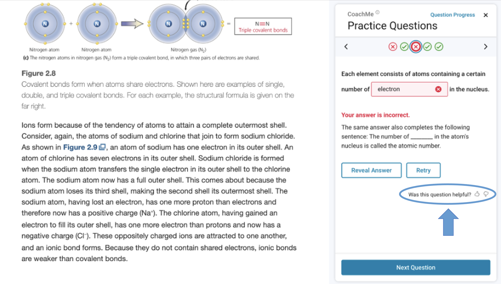

# Improving Automatically Generated Fill-in-the-Blank Answer Selection with an LLM-Based Agreement Filter Dataset

This directory contains the dataset and analysis code for our project
investigating the effectiveness of using large language models (LLMs)
as an agreement filter to improve the selection of answer blanks in
automatic fill-in-the-blank (FITB) cloze question generation, as
discussed in our paper:

Johnson, B. G., Dittel, J. S., & Van Campenhout, R. (2025). Improving
automatically generated fill-in-the-blank answer selection with an
LLM-based agreement filter. In _Proceedings of the EDM Causal
Inference Workshop at EDM 2025_. https://doi.org/PLACEHOLDER_DOI

This paper was presented at [EDM
2025](https://educationaldatamining.org/edm2025/) as part of the
[Causal Inference Workshop](PLACEHOLDER_LINK) (link to be updated when
available).

## Description

Formative practice embedded within textbooks has been shown to
increase learning outcomes. However, manually authoring high-quality
formative practice questions is resource-intensive and impractical at
scale. Recent advances in automatic question generation (AQG) have
enabled large-scale creation of formative practice questions.

Building on these advances, we have introduced CoachMe, a free study
feature integrated into the VitalSource Bookshelf ereader
platform. CoachMe delivers formative practice through automatically
generated (AG) questions placed directly within electronic
textbooks. AG questions have already been added to thousands of
textbooks, serving millions of students. CoachMe supports several
question types, including FITB, matching, multiple choice, and free
response.

As shown below, CoachMe questions appear in a panel next to the
textbook content. Students can make unlimited attempts, receive
immediate feedback, and reveal answers if needed. They can also rate
questions after answering with a social media-style 👍 or 👎, and
these ratings are the specific focus of this dataset.

This study specifically investigates whether incorporating an
LLM-based agreement filter into the existing rule-based AQG pipeline
can improve the selection of answer blanks for FITB questions. The
hypothesis is that when both the rule-based method and LLM agree on
the selected blank, the resulting question is perceived as higher
quality by students.

Drawing on an explanatory modeling framework, this project assesses
whether students are more likely to give a 👍 and less likely to give
a 👎 rating when the LLM-selected blank matches the rule-based
blank. Research consistently indicates that positive student
perceptions correlate strongly with enhanced engagement, motivation,
and persistence in learning tasks. Therefore, successful LLM-based
agreement filtering could enhance large-scale formative practice by
highlighting clearer, more conceptually central questions.

The dataset for this analysis is a subset of a [previously released
dataset](https://github.com/vitalsource/data/tree/aied-2025-itextbooks/edm-2024),
specifically focused on FITB cloze question interactions recorded
between January 1, 2022, and January 16, 2024. Student-question
sessions were formed by grouping all actions of a single student on a
single question. Filtering for publishers granting permission for
generative AI research resulted in a dataset comprising 1,305,957
sessions across 210,902 questions, 106,183 students, and 2,510
textbooks, predominantly from the Social Science, Psychology, and
Political Science domains.

Eleven hypotheses were tested, with hypotheses H1–H10 validated in
earlier work and included here as control variables, and hypothesis
H11 newly introduced as the primary focus of this analysis:

| Hypothesis | Description                                                                                                                                                |
| ---------- | ---------------------------------------------------------------------------------------------------------------------------------------------------------- |
| H1         | Answering a question correctly on the first attempt will increase the chance of a 👍 and decrease the chance of a 👎.                                      |
| H2         | As a student answers more questions, the chance of giving a 👍 or 👎 will decrease.                                                                        |
| H3         | Receiving a spelling correction suggestion for an answer will increase the chance of a 👍 and decrease the chance of a 👎.                                 |
| H4         | Questions created from more important sentences in the textbook will receive more 👍 and fewer 👎.                                                         |
| H5         | Questions with answer words that are more important in the textbook will receive more 👍 and fewer 👎.                                                     |
| H6         | Questions with noun and adjective answer words will receive more 👍 and fewer 👎 than verb and adverb answer words.                                        |
| H7         | Questions with rarer words as the answer will receive more 👍 and fewer 👎 than questions with more common words as the answer.                            |
| H8         | Questions where the answer blank occurs early in the sentence will receive fewer 👍 and more 👎.                                                           |
| H9         | Questions that give elaborative feedback after an incorrect answer will receive more 👍 and fewer 👎 than questions that give only outcome feedback.       |
| H10        | Questions that have been reviewed by a human before inclusion will receive more 👍 and fewer 👎 than questions that did not have human review.             |
| **H11**    | **Questions where the LLM-selected answer matches the rule-based answer will receive more 👍 and fewer 👎 than questions where the answers do not match.** |

Mixed effects logistic regression modeling was used to test whether
questions flagged by LLM-rule agreement (H11) receive improved student
feedback, controlling for previously validated explanatory variables
(H1–H10). In the explanatory modeling framework followed, a
statistically significant relationship between an explanatory variable
and a rating outcome provides evidence that the relationship in the
corresponding hypothesis is causal.

Further details can be found in the paper above.

## Data Files and Analysis Code

The files provided are:

| File                              | Description                                                           |
| --------------------------------- | --------------------------------------------------------------------- |
| `sessions.parquet`                | Student-question sessions dataset                                     |
| `questions.parquet`               | Question-level dataset including text and aggregated interaction data |
| `llm_select_blanks.py`            | Prompt and code used for LLM answer blank selection                   |
| `Answer Selection Analysis.ipynb` | Jupyter notebook for replication of data analysis in the paper        |

The sessions dataset includes the following fields:

| Field                       | Type        | Definition                                                                                            |
| --------------------------- | ----------- | ----------------------------------------------------------------------------------------------------- |
| `student_id`                | string      | Anonymized student identifier                                                                         |
| `question_id`               | string      | Unique question identifier                                                                            |
| `textbook_id`               | string      | Unique textbook identifier                                                                            |
| `subject`                   | string      | Textbook's BISAC major subject heading (e.g., "Social Science")                                       |
| `thumbs_up`                 | categorical | 1 if student gave the question a 👍 rating, 0 otherwise                                               |
| `thumbs_down`               | categorical | 1 if student gave the question a 👎 rating, 0 otherwise                                               |
| `H1_first_correct`          | categorical | 1 if student's first answer is correct, 0 otherwise                                                   |
| `H2_cumulative_answered`    | integer     | Total number of questions answered by the student up to the session                                   |
| `H3_spelling_suggestion`    | categorical | 1 if student received a spelling suggestion, 0 otherwise                                              |
| `H4_sentence_textrank_rank` | continuous  | Sentence importance ranking within textbook chapter (0=most important to 1=least important)           |
| `H5_answer_tf_idf_rank`     | continuous  | Importance ranking of the answer word within textbook chapter (0=most important to 1=least important) |
| `H6_answer_pos`             | categorical | Part of speech of answer word (`ADJ`, `ADV`, `NOUN`, `PROPN`, `VERB`)                                 |
| `H7_answer_log_probability` | continuous  | Log probability estimate of answer word frequency                                                     |
| `H8_answer_location`        | integer     | Position of answer blank in the sentence (0=first word)                                               |
| `H9_feedback`               | categorical | Type of feedback given (`common_answer`, `context`, `outcome`)                                        |
| `H10_reviewed`              | categorical | 1 if question was manually reviewed, 0 otherwise                                                      |
| `H11_llm_aligned`           | categorical | 1 if LLM-selected answer matches rule-based answer, 0 otherwise                                       |

The questions dataset includes the following fields:

| Field             | Type        | Definition                                                      |
| ----------------- | ----------- | --------------------------------------------------------------- |
| `question_id`     | string      | Unique question identifier                                      |
| `textbook_id`     | string      | Unique textbook identifier                                      |
| `subject`         | string      | Textbook's BISAC major subject heading (e.g., "Social Science") |
| `students`        | integer     | Number of unique students who interacted with the question      |
| `thumbs_up`       | integer     | Total number of 👍 ratings for the question                     |
| `thumbs_down`     | integer     | Total number of 👎 ratings for the question                     |
| `stem`            | string      | Text of the rule-based question with a blank to fill in         |
| `answer`          | string      | Correct answer to the rule-based question                       |
| `sentence`        | string      | Original sentence from which the question was derived           |
| `llm_stem`        | string      | Text of the LLM-based question with a blank to fill in          |
| `llm_answer`      | string      | Correct answer to the LLM-based question                        |
| `H11_llm_aligned` | categorical | 1 if LLM-selected answer matches rule-based answer, 0 otherwise |

## Acknowledgments

We thank the following publishers for granting permission to release
the automatically generated ***revise wording*** questions in the
dataset for their textbooks:

- OpenStax
- SAGE Publications
- Taylor & Francis

## Contact Us

If you have questions, please feel free to email benny.johnson@vitalsource.com.
