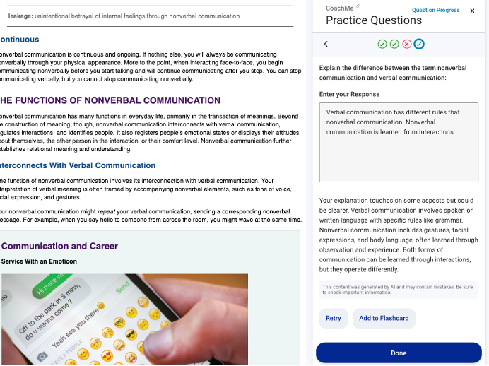

# Scaling Effective Characteristics of Intelligent Tutoring Systems Dataset

This directory contains the dataset and analysis code for our paper:

Van Campenhout, R., Dittel, J. S., & Johnson, B. G. (2025). Scaling
effective characteristics of ITSs: A preliminary analysis of LLM-based
personalized feedback. In *Proceedings of the 21st International
Conference on Intelligent Tutoring Systems (ITS 2025)*. \*\*\*FINISH
REF. [https://doi.org/PLACEHOLDER_DOI](https://doi.org/PLACEHOLDER_DOI)

We are honored to have received the \*\*\*[Best Short Paper Award
(update link when available)](PLACEHOLDER_LINK) at [ITS
2025](https://iis-international.org/its2025-generative-systems/) for
this work. Thank you, ITS!

## Description

Intelligent tutoring systems represent the gold standard in digital
learning due to their personalized instruction capabilities, but
scaling these features remains challenging. Recent advancements in
large language models (LLMs) offer new possibilities for scaling
effective tutoring features, particularly personalized feedback.

In fall 2024, a generative AI–based feedback feature was introduced
into the existing automatic question generation system used in the
VitalSource Bookshelf platform. This feature was designed to
facilitate personalized, open-ended responses at scale. Two new
question types were created: exam question writing, which encourages
students to design their own test questions, and compare and contrast
(C&C), requiring students to explain differences between closely
related terms.

As shown below, the questions open in a panel next to the textbook
content. As formative practice, students are allowed as many answer
attempts as they like, receiving immediate LLM-generated feedback.

<p align="center">

</p>

This analysis specifically focuses on the effectiveness of
LLM-generated personalized feedback in the C&C questions. These
open-ended questions aim to enhance conceptual clarity by having
students identify and articulate differences between terms.

The dataset comprises student-question sessions from a natural
learning context, specifically a 100-level Introduction to
Communication Studies course at a large public university in the
United States, collected between August 15 and December 26, 2024. Each
session encompasses all actions by an individual student on a single
question in chronological order, capturing question attempts, answer
correctness, feedback received, and student behavior such as revisions
and interactions with LLM-generated feedback.

The primary research goals were to:

- Evaluate the feasibility and effectiveness of LLM-based personalized feedback in formative practice.
- Analyze student behaviors in response to feedback, including revision strategies and engagement levels.
- Identify patterns distinguishing meaningful engagement from superficial copying of LLM-generated feedback.

Descriptive statistical analysis and text-analysis methods were
employed to explore these relationships, providing insights into
student learning behaviors and the impact of personalized feedback.

Further methodological details and analysis results can be found in
the accompanying paper.

## Data Files and Code Notebooks

The provided files are:

| File                                 | Description                                                    |
| ------------------------------------ | -------------------------------------------------------------- |
| `events.parquet`                     | Student-question interaction events                            |
| `sessions.parquet`                   | Student-question sessions                                      |
| `categorize_attempts.py`             | Script assigning student answer categories using LLM analysis  |
| `Feedback Engagement Analysis.ipynb` | Jupyter notebook for replication of data analysis in the paper |

The data files are in Apache Parquet format. The Python code example
below loads the sessions data into a pandas dataframe:

```python
import pandas as pd
sessions = pd.read_parquet( 'sessions.parquet' )
```

In the dataset, student answer attempts are classified using shorthand
symbols to represent their accuracy and authenticity. Although these
symbols (+, -, x) are not used in the paper, they correspond directly
to the categories defined in the following table:

| Category    | Symbol | Description                                                                                             |
| ----------- | ------ | ------------------------------------------------------------------------------------------------------- |
| Correct     | +      | The response accurately addressed the key distinction between terms.                                    |
| Incorrect   | -      | The response did not sufficiently answer the question, despite appearing to be a genuine effort.        |
| Non-Genuine | x      | The response did not constitute a legitimate attempt (e.g., random characters, “idk”, irrelevant text). |

The interaction event fields are:

| Field              | Type    | Definition                                         |
| ------------------ | ------- | -------------------------------------------------- |
| `timestamp`        | string  | Date and time of answer attempt                    |
| `question_id`      | string  | Unique identifier for question                     |
| `student_id`       | string  | Anonymized student identifier                      |
| `question`         | string  | Text of question                                   |
| `attempt_number`   | integer | Sequential number of student's answer attempt      |
| `answer`           | string  | Student-provided answer                            |
| `feedback`         | string  | Feedback given by LLM on answer attempt            |
| `attempt_category` | string  | Answer attempt accuracy and authenticity (+, -, x) |
| `answer_length`    | integer | Length of answer attempt in words                  |

The session fields are:

| Field                    | Type   | Definition                                                                                                              |
| ------------------------ | ------ | ----------------------------------------------------------------------------------------------------------------------- |
| `question_id`            | string | Unique identifier for question                                                                                          |
| `student_id`             | string | Anonymized student identifier                                                                                           |
| `pattern`                | string | Concatenation of `attempt_category` symbols for student answer attempts on question                                     |
| `first_attempt`          | string | Category of first answer attempt (+, -, x)                                                                              |
| `second_attempt`         | string | Category of second answer attempt (missing if no second attempt)                                                        |
| `second_attempt_elapsed` | float  | Elapsed time (s) between student's first and second attempts                                                            |
| `second_attempt_overlap` | float  | Degree of textual overlap ([0, 1]) between student's second attempt and LLM's feedback on student's first attempt       |

## Contact Us

If you have questions, please feel free to email
[benny.johnson@vitalsource.com](mailto:benny.johnson@vitalsource.com).
