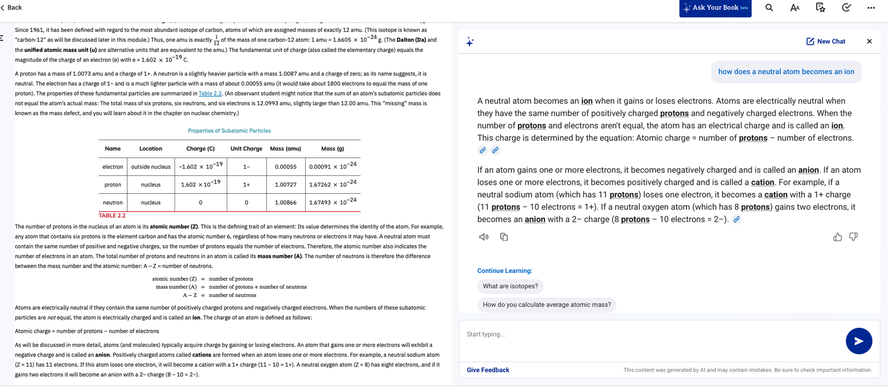
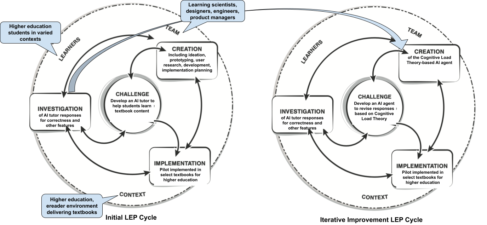

# Cognitive Load Theory Evaluation of AI Tutor Responses Dataset

Van Campenhout, R., Dittel, J. S., & Johnson, B. G. (2026). When correct isn't enough: A cognitive load theory critical analysis for AI tutor responses. In *Proceedings of the 34th International Conference on Software, Telecommunications and Computer Networks (SoftCOM 2026)*. IEEE.

[Official citation and PDF link will be added upon publication.]

This paper was presented at [SoftCOM 2026](https://2026.softcom.fesb.unist.hr/), the 34th International Conference on Software, Telecommunications and Computer Networks.

## Description

Chat-based AI tutors offer new possibilities for personalized student support, but evaluating their quality requires methods that go beyond factual correctness alone. This dataset and accompanying analysis examine 500 student–AI tutor interactions through the lens of cognitive load theory (CLT), specifically targeting extraneous cognitive load (ECL) — content in tutor responses that is not essential to answering the student's query and may burden working memory without supporting learning.

The AI tutor studied here is a textbook-aligned chat companion deployed within the VitalSource Bookshelf etextbook platform. The tutor appeared alongside textbook content in a chat window and was constrained to answering study-related questions using only licensed textbook material. Students were offered suggested uses including explaining challenging content, practice questions, study plans, and exam preparation. Student participation in the pilot was voluntary and unrelated to course instruction.

 <b>Figure 1.</b> An example AI tutor interaction open alongside the etextbook.

The study proceeded in two phases, organized using the learning engineering process (LEP) model — a cyclical framework for applying learning science principles through iterative development, implementation, and investigation.

**Phase 1** analyzed the original tutor responses using two LLM-as-judge classifiers developed iteratively with GPT-5 and human review. The correctness judge labeled each response as correct, incorrect, or incomplete (factually accurate but insufficiently answering the query). The ECL judge assessed whether responses contained information beyond what was essential for answering the student's question.

**Phase 2** developed a CLT-informed revision agent that postprocessed tutor responses to reduce extraneous content while enforcing correctness and completeness. The same 500 interactions were re-evaluated after revision using identical judge criteria, enabling direct before-and-after comparison.

 <b>Figure 2.</b> The LEP model for Phase 1 (left) and the subsequent LEP model for Phase 2 (right).

The dataset contains 500 randomly sampled single-turn student–AI tutor interactions collected during a voluntary pilot deployment from May to August 2025, across 170 textbooks and 305 students, drawn from textbooks published by five publishers who granted explicit permission for generative AI research. Multi-turn conversations were excluded to focus on responses interpretable without prior conversational context, and interactions were further limited to queries whose answers could be externally verified through general knowledge. Using the Book Industry Standards and Communications (BISAC) major subject heading classification, the top subject domains as a percentage of interactions were Social Science (30.8%), History (11.4%), Business & Economics (9.4%), Psychology (8.4%), and Political Science (8.0%).

The research questions addressed in the two phases were:

1. How prevalent is the inclusion of extraneous cognitive load in AI tutor responses?
2. How does a CLT-informed revision agent impact ECL rates in tutor responses?

## Example Interaction

The following example illustrates how the ECL judge classifies a tutor response as extraneous, and how the CLT revision agent subsequently revises it. The interaction comes from a criminology textbook.

**Student query:** "What is behaviorism and positivism?"

**Original tutor response:** Behaviorism is an empiricist approach that was pioneered by American psychologist J. B. Watson in the first decade of the 20th century. It derives from a philosophy known as positivism, which emerged from the natural sciences and regards the world as fixed and quantifiable. Behavioral psychologists shifted the research focus away from the realm of the mind and argued that an individual's identity was shaped by their responses to the external environment, which formed stable and recognizable patterns of behavior that could be publicly observed. Watson was inspired by Russian physiologist Ivan Pavlov, who was famously conducting experiments with dogs, producing conditioned responses to external stimuli. Meanwhile, in criminology, the search for objective knowledge through the positive application of science was also having a significant impact. The endeavor to observe and measure the relationship between cause and effect led to a belief that criminality is not a matter of free will but caused by a biological, psychological, or social disposition over which the offender has little or no control. Does that explanation clarify how behaviorism and positivism are related, and how they influenced criminology?

**ECL judge classification:** `EXTRANEOUS` — The response provides correct core definitions but elaborates on historical origins (Watson, Pavlov, natural sciences) and specific criminological applications that go beyond what the query requires, introducing concepts not essential for schema construction.

**Revised tutor response (CLT revision agent):** Behaviorism is a psychological approach that studies observable behaviors and their relationship to environmental stimuli, positing that behavior is learned through conditioning. Positivism is a philosophical stance asserting that knowledge should be based solely on empirical evidence and scientific methods, focusing on objectively observable and measurable phenomena. Behaviorism is essentially an application of positivist principles to the study of behavior.

The CLT agent reduced the original response from 184 words to 60 while preserving the core definitions and the relationship between the two terms. In the dataset, the original response is labeled `EXTRANEOUS` and `CORRECT`; the revised response is labeled `NEED_ONLY` and `CORRECT`.

## Data Files and Analysis Code

| File | Description |
|------|-------------|
| `interactions.parquet` | Labeled dataset of 500 student–AI tutor interactions, including original and revised responses and all judge labels |
| `correctness_judge_prompt.txt` | LLM-as-judge prompt used to classify tutor response correctness (`CORRECT` / `INCORRECT` / `INCOMPLETE`) |
| `ecl_judge_prompt.txt` | LLM-as-judge prompt used to classify presence of extraneous cognitive load (`NEED_ONLY` / `EXTRANEOUS`) |
| `revision_agent_prompt.txt` | CLT revision agent prompt used to postprocess tutor responses |
| `CLT Evaluation of AI Tutor Responses.ipynb` | Analysis notebook reproducing all descriptive results reported in the paper |

The dataset contains the following fields:

| Field | Type | Description |
|-------|------|-------------|
| `student_id` | `string` | Anonymized student identifier. |
| `textbook_id` | `string` | Unique textbook identifier. |
| `subject` | `categorical` | BISAC major subject heading for the textbook. |
| `student_query` | `string` | Student's original question to the AI tutor. |
| `original_response` | `string` | Original AI tutor response. |
| `original_correctness` | `categorical` | Correctness judge label for original response: `CORRECT`, `INCORRECT`, or `INCOMPLETE`. |
| `original_ecl` | `categorical` | ECL judge label for original response: `NEED_ONLY` or `EXTRANEOUS`. |
| `revised_response` | `string` | Tutor response after CLT revision agent postprocessing. |
| `revised_correctness` | `categorical` | Correctness judge label for revised response: `CORRECT`, `INCORRECT`, or `INCOMPLETE`. |
| `revised_ecl` | `categorical` | ECL judge label for revised response: `NEED_ONLY` or `EXTRANEOUS`. |

## Acknowledgments

We gratefully acknowledge the following publishers for granting permission to include student interactions with their textbooks through the AI tutor pilot as part of this open dataset:

- Emond Publishing
- F.A. Davis
- Human Kinetics
- OpenStax
- SAGE Publications, Inc. (US)

## Contact Us

If you have questions, please feel free to email [benny.johnson@vitalsource.com](mailto:benny.johnson@vitalsource.com).
